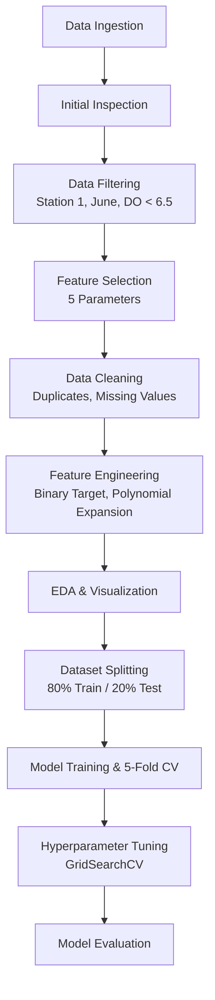

# COMPROG1 Final Project
## Automated Analysis of Aquaculture Water Quality Stability

[](https://python.org)
[](https://jupyter.org)
[](https://scikit-learn.org)
[]()

**A Python data pipeline for environmental monitoring and predictive model evaluation under stable aquaculture conditions.**

[Overview](#overview) • [Dataset](#dataset) • [Pipeline](#pipeline) • [Results](#results) • [Usage](#usage) • [Citation](#citation)

</div>

---

## Overview

> This project implements a structured, modular workflow that processes raw sensor data through ingestion, cleaning, feature engineering, statistical analysis, multi-model comparison, and visualization.

Developed as the final project for **Computer Programming 1 (COMPROG1)**, the study examines Station 1 data from June 2022 — a high-temperature period where reduced oxygen solubility is expected — to assess whether machine learning models can predict anoxic conditions when environmental parameters remain stable.

**Key takeaway:** *Stable environmental conditions with limited variability fundamentally constrain ML predictive performance. Data variability, not model complexity, is the primary limiting factor.*

---

## Dataset

```
Source:      Kaggle — Aquaculture Water Quality Dataset
Filter:      Station 1, June 2022, DO < 6.5 mg/L
Records:     61 observations
Features:    Temperature, pH, Ammonia, Nitrate, Turbidity
Target:      Anoxic (DO < 5.8 mg/L = 1, else 0)
Balance:     31 Normal / 30 Anoxic
```

| Parameter | Mean | Median | Std Dev |
|:----------|:----:|:------:|:-------:|
| DO (mg/L) | 5.77 | 5.80 | 0.42 |
| Temp (C) | 27.92 | 27.90 | 1.71 |
| pH | 7.06 | 6.97 | 1.02 |
| Ammonia (mg/L) | 0.03 | 0.03 | 0.01 |
| Nitrate (PPM) | 21.61 | 22.20 | 11.57 |
| Turbidity | 26.25 | 26.06 | 6.99 |

---

## Pipeline



### Models Evaluated

```python
models = {
    'Logistic Regression': LogisticRegression(C=1.0, max_iter=2000),
    'Random Forest': RandomForestClassifier(n_estimators=100, max_depth=5),
    'SVM (RBF)': SVC(C=1.0, kernel='rbf', probability=True),
    'KNN (k=5)': KNeighborsClassifier(n_neighbors=5, weights='distance')
}
```

---

## Results

### Environmental Stability Findings

- `Dissolved Oxygen` — moderate and consistent: **mean = 5.77 mg/L, sigma = 0.42**
- `Temperature` — elevated but stable: **mean = 27.92 C**
- `Temperature-DO correlation` — weak inverse: **r = -0.13**
- `Inter-feature correlations` — all weak: **|r| < 0.22**

### Model Performance Summary

| Model | Feature Set | CV Accuracy | Test Accuracy | AUC-ROC |
|:------|:-----------:|:-----------:|:-------------:|:-------:|
| Logistic Regression | Original (5) | 49.9% | 30.8% | 0.429 |
| Logistic Regression | Polynomial (20) | 42.6% | 23.1% | 0.405 |
| Random Forest | Original (5) | 44.1% | 23.1% | 0.191 |
| Random Forest | Polynomial (20) | 42.8% | 23.1% | 0.191 |
| SVM (RBF) | Original (5) | 42.6% | 30.8% | 0.667 |
| SVM (RBF) | Polynomial (20) | 39.2% | 38.5% | 0.643 |
| KNN (k=5) | Original (5) | 45.8% | 38.5% | 0.333 |
| KNN (k=5) | Polynomial (20) | 47.3% | 46.2% | 0.381 |
| **KNN (Tuned)** | — | **58.4%** | **38.5%** | — |

> **Note:** All test accuracies remain below the 50% random-guess baseline. Polynomial expansion and GridSearchCV failed to improve performance, confirming **data variability** — not model inadequacy — as the fundamental constraint.

<details>
<summary><b>Hyperparameter Tuning Details</b></summary>

```
KNN Grid (28 combinations):
  n_neighbors: {3, 5, 7, 9, 11, 13, 15}
  weights: {uniform, distance}
  metric: {euclidean, manhattan}

Random Forest Grid (24 combinations):
  n_estimators: {50, 100, 200}
  max_depth: {3, 5, 7, None}
  min_samples_split: {2, 5}

Best KNN Config: k=11, weights='distance', metric='manhattan'
```

</details>

---

## Repository Structure

```
COMPROG1_FINAL-PROJECT/
|
|-- Machine_Learning_Code.ipynb      # Main analysis notebook
|-- main.py                           # Pipeline script
|-- filtered_dataset.csv              # Preprocessed dataset
|-- requirements.txt                  # Python dependencies
|-- CRESENCIO_2043_IEEE_Paper.pdf    # Full research paper
|
|-- outputs/                          # Generated figures & animations
|   |-- fig_model_comparison.png
|   |-- fig_model_comparison_vertical.png
|   |-- fig_confusion_matrices.png
|   |-- fig_feature_importance.png
|   |-- fig_cv_stability_boxplot.png
|   |-- fig_correlation_heatmap.png
|   |-- fig_class_distribution.png
|   |-- fig_histogram_do.png
|   |-- fig_scatter_temp_do.png
|   |-- fig_boxplot_parameters.png
|   |-- anim1_do_progression.gif
|   |-- anim2_rolling_distribution.gif
|   |
|   |-- complete_model_results.csv
|   |-- model_comparison_results.csv
```

---

## Usage

### Setup

```bash
# Clone the repository
git clone https://github.com/centaurids-hub/COMPROG1_FINAL-PROJECT.git
cd COMPROG1_FINAL-PROJECT

# Create virtual environment (optional but recommended)
python -m venv venv
source venv/bin/activate  # Linux/Mac
# or: venv\\Scripts\\activate  # Windows

# Install dependencies
pip install -r requirements.txt
```

### Run

```bash
# Launch Jupyter Notebook
jupyter notebook Machine_Learning_Code.ipynb

# Or run the pipeline script
python main.py
```

---

## Tech Stack

| Category | Tools |
|:---------|:------|
| Language | `Python 3.10+` |
| Data Processing | `pandas`, `NumPy` |
| Machine Learning | `scikit-learn` |
| Visualization | `Matplotlib`, `Seaborn` |
| Animation | `matplotlib.animation` |
| Environment | `Python script` |

---

## Citation

If referencing this work in your research:

> Cresencio, J. S. (2026). *Automated Analysis of Aquaculture Water Quality Stability and Evaluation of Predictive Modeling Using Python Data Pipelines*. COMPROG1 Final Project, Technological University of the Philippines — Manila.

Full paper: [`CRESENCIO_2043_IEEE_Paper.pdf`](./CRESENCIO_2043_IEEE_Paper.pdf)

---

## Author

**Jesier S. Cresencio**  
Department of Electronics Engineering  
Technological University of the Philippines, Manila  
`jesiercresencio12@gmail.com`

---

<div align="center">

**Developed under the guidance of the COMPROG1 faculty, TUP Manila.**

Dataset sourced from <a href="https://www.kaggle.com/datasets">Kaggle</a>

</div>
"""
